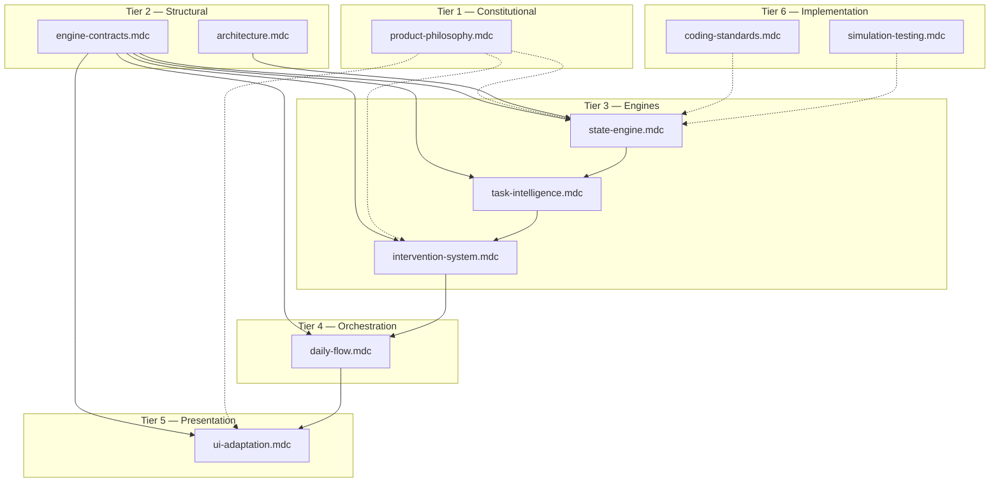

# Momentum OS — Master Rules Summary

Human-readable index for the `.cursor/rules/` system. This file is not a Cursor rule — it guides agents and developers on how to use the rule files.

**Master agent prompt:** [AGENTS.md](../../AGENTS.md) — start here. Cursor agents should read `AGENTS.md` first, then apply the rule files below.

## Purpose

These rules compress [docs/architecture-freeze.md](../../docs/architecture-freeze.md), [docs/engine-contracts.md](../../docs/engine-contracts.md), and [docs/ai-regulations.md](../../docs/ai-regulations.md) into enforceable AI instructions. They prevent architectural drift, behavioral logic leakage into UI, and productivity-app regression during AI-assisted implementation.

**How Cursor loads rules:**
- `alwaysApply: true` rules (`product-philosophy`, `architecture`) are active in every session.
- Glob-scoped rules activate when matching files are open or edited.
- When multiple rules apply, use the priority ladder below to resolve conflicts.

---

## File Responsibility Matrix

| File | Tier | Activates On | Responsibility |
|------|------|--------------|----------------|
| `product-philosophy.mdc` | 1 | Always | Constitutional gate: 9 Non-Negotiables, trust boundaries, forbidden behaviors, probabilistic language |
| `architecture.mdc` | 2 | Always | Structural law: folder freeze, state authority, data flow, persistence, engine boundaries, versioning |
| `engine-contracts.mdc` | 2 | `src/core/**`, `src/types/**` | Canonical type shapes — single source of truth; engines import, never redefine |
| `state-engine.mdc` | 3 | `src/engine/state/**`, `trajectory/**`, `reentry/**` | UserState derivation, mode vs trajectory semantics, transitions, re-entry behavior |
| `task-intelligence.mdc` | 3 | `src/engine/tasks/**` | Task scoring, burden analysis, sequencing logic |
| `intervention-system.mdc` | 3 | `src/engine/interventions/**` | Intervention triggers, suppression, cooldown, escalation (level 0 default) |
| `daily-flow.mdc` | 4 | `src/orchestration/**`, `src/routes/**` | Pipeline orchestration wiring, DailyOutputs assembly, zero reasoning |
| `ui-adaptation.mdc` | 5 | `src/ui/**`, `src/adaptation/**`, `**/*.tsx`, `src/hooks/**` | Adaptation projection consumption, UI rendering, legacy behavioral freeze |
| `coding-standards.mdc` | 6 | `**/*.{ts,tsx}` | Pure TS engines, import direction, legacy freeze, unit tests, AI safety patterns |
| `simulation-testing.mdc` | 6 | `src/testing/**`, `**/*.test.ts`, `**/*.spec.ts` | Scenario-based temporal tests, spec-validity assertions, regression guards |

---

## Ownership Diagram

### Boundary Summary

| Layer | Owns | Must NOT |
|-------|------|----------|
| **Contracts** (`engine-contracts`) | Type shapes, enums, primitives | Computation, algorithms |
| **State Engine** | UserState derivation, transitions, trajectory | Type definitions, task sequencing |
| **Task Intelligence** | Scoring, sequencing decisions | Type definitions, task storage, UI |
| **Intervention Engine** | Trigger evaluation, suppression | Type definitions, UI rendering |
| **Orchestration** | Pipeline wiring, DailyOutputs | Scoring, interpretation |
| **UI Adaptation** | Projection rendering | Behavioral computation |
| **Simulation Testing** | Scenario timelines, semantic assertions | Type definitions, engine behavior |

---

## Priority Ladder

When rules conflict, highest tier wins:

1. **`product-philosophy.mdc`** — Constitutional. Engagement/retention wins that violate autonomy or sustainability are rejected.
2. **`architecture.mdc` + `engine-contracts.mdc`** — Structural law (tie at tier 2). Architecture wins folder placement; engine-contracts wins type shape.
3. **Engine pipeline order** — Upstream wins: `state-engine` > `task-intelligence` > `intervention-system` > adaptation computation.
4. **`daily-flow.mdc`** — Pipeline sequence cannot be reordered for UI convenience.
5. **`ui-adaptation.mdc`** — Presentation constraints; UI simplification never justifies engine bypass.
6. **`coding-standards.mdc` + `simulation-testing.mdc`** — Implementation discipline (tie at tier 6). Never overrides tiers 1–5.

### Special Cases

- **Legacy Cadence vs target architecture** → architecture + coding-standards win. No new behavioral logic in `src/lib/store.ts` or legacy hooks.
- **Duplicate type vs engine behavior** → engine-contracts wins shape; engine rule wins computation.
- **Technically valid vs spec-compliant output** → simulation-testing + upstream engine rule win.

---

## Workflow for AI Agents

Before implementing any feature:

1. **Constitutional check** — Run 9 Non-Negotiables from `product-philosophy.mdc`.
2. **Folder verification** — Confirm target path matches `architecture.mdc` frozen structure.
3. **Ownership check** — Identify which engine owns the behavior. Types go in `src/core/` per `engine-contracts.mdc`.
4. **Implement** — Pure TypeScript in `src/engine/`. Import types from `src/core/`. No framework deps in engines.
5. **Orchestrate** — Wire via `src/orchestration/` if part of daily flow. No scoring in orchestration.
6. **Project** — Map `AdaptationOutput` → UI tokens in `src/adaptation/`.
7. **Render** — Components consume projections only. No behavioral `if` in JSX.
8. **Test** — Unit tests per `coding-standards.mdc`. Scenario simulations per `simulation-testing.mdc`.

---

## Legacy Migration Note

The current codebase contains legacy Cadence patterns:
- Monolithic `src/lib/store.ts` with behavioral selector hooks
- Route components with embedded behavioral logic
- No `src/engine/` or `src/core/` directories yet

**Strict freeze:** Do not add new behavioral logic to legacy paths. On first engine work, create the frozen folder structure and extract logic into appropriate engine modules. `CLAUDE.md` describes the legacy Cadence implementation; these rules supersede it for behavioral architecture.

---

## Canonical Doc Pointers

For deep reference beyond compressed rules:

| Topic | Source |
|-------|--------|
| System architecture freeze | [docs/architecture-freeze.md](../../docs/architecture-freeze.md) |
| Engine type contracts | [docs/engine-contracts.md](../../docs/engine-contracts.md) |
| AI regulations / Non-Negotiables | [docs/ai-regulations.md](../../docs/ai-regulations.md) |
| User-facing daily rhythm | [src/components/help/help-content.ts](../../src/components/help/help-content.ts) |

---

## Deduplication Quick Reference

| Topic | Owner | Others reference |
|-------|-------|------------------|
| 9 Non-Negotiables | product-philosophy | coding-standards |
| Folder structure | architecture | coding-standards |
| Type shapes | engine-contracts | all engine rules |
| Mode vs trajectory semantics | state-engine | engine-contracts (enums only) |
| Silent adaptation default | product-philosophy + intervention-system | — |
| Unit tests | coding-standards | simulation-testing |
| Scenario tests | simulation-testing | coding-standards |
| UI behavioral freeze | ui-adaptation | coding-standards |
